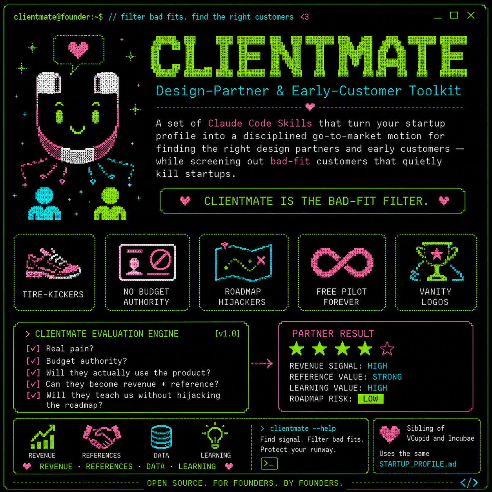

<p align="center">
  
</p>

# ClientMate — Design-Partner & Early-Customer Toolkit

A set of Claude Code Skills that turn your startup profile into a disciplined go-to-market motion for finding the *right* design partners and early customers — and screening out the ones that quietly kill startups.

The wrong early customer is as dangerous as no customer: the tire-kicker with no real pain, the champion with no budget authority, the whale who hijacks your roadmap, the free-pilot-forever logo that never converts, the vanity name that proves nothing because no one there actually uses the product. **ClientMate is the bad-fit filter** — and the engine for finding the partners who give you revenue, references, data, and learning.

It is the sibling of [VCupid](https://github.com/maxoliverbr/vcupid-plugin) (fundraising) and Incubae (program evaluation), and reads the **same `STARTUP_PROFILE.md`** — maintain one profile, use all three toolkits.

---

## The Workflow

Run commands in this order to build and qualify your design-partner pipeline:

```
# 0. Create your STARTUP_PROFILE.md (shared with VCupid and Incubae)

# 1. Define who you should — and shouldn't — sell to
/cmstrat

# 2. Build the target account list
/cmlist

# 3. For each Tier 1 account — bad-fit check first:
/cmposer <account name>          # Will this relationship advance or bleed you? Drop if score < 40.

# 4. For each account that passes (score 60+):
/cmmatch <account name>          # Map the deal, the champion, and the path in
/cmvalue <account name>          # What do they give you beyond revenue, net of cost to serve?

# 5. Harden your pitch against a real buyer before any call:
/cmdevil

# 6. For each account with a /cmmatch "Pursue" verdict:
/cmreach cmmatch-<account>.md    # Draft outreach to the champion

# 7. When a discovery call is booked:
/cmprep cmmatch-<account>.md
```

**File naming convention:**

| File                        | Purpose                                                              |
| --------------------------- | -------------------------------------------------------------------- |
| `STARTUP_PROFILE.md`        | Your startup data — shared across VCupid, Incubae, and ClientMate    |
| `cmstrat.md`                | Strategy — your Ideal Design Partner Profile, ICP, asks, anti-patterns |
| `cmlist.md`                 | Master target account pipeline, tiered                               |
| `cmposer-<account>.md`      | Bad-fit check — pain, budget, velocity, roadmap, conversion          |
| `cmmatch-<account>.md`      | Deep fit analysis — 7-dimension score, champion map, deal shape      |
| `cmvalue-<account>.md`      | Value audit — commercial + strategic, netted against cost to serve   |
| `cmreach-<account>.md`      | Outreach to the champion — cold email, warm intro, LinkedIn          |
| `cmprep-<account>.md`       | Discovery call prep + disqualify triggers                            |
| `cmdevil.md`                | The skeptical buyer — 10 deal-ending questions                       |

---

## Installation

These commands install as the `clientmate` Claude Code plugin (works in any project directory).

**1. Clone the plugin:**

```
git clone https://github.com/maxoliverbr/clientmate-plugin.git ~/dev/clientmate
```

**2. Run the install script:**

```
cd ~/dev/clientmate && bash install.sh
```

The script registers the plugin in `~/.claude/plugins/installed_plugins.json` and enables it in `~/.claude/settings.json`. It is idempotent — safe to re-run after updates.

**3. Restart Claude Code.** All `/cm*` commands become available in any directory that contains a `STARTUP_PROFILE.md`.

**Manual installation**

Register in `~/.claude/plugins/installed_plugins.json`:

```
"clientmate@local": [{
  "scope": "user",
  "installPath": "/home/<you>/dev/clientmate",
  "version": "1.0.0",
  "installedAt": "<ISO timestamp>",
  "lastUpdated": "<ISO timestamp>"
}]
```

Enable in `~/.claude/settings.json`:

```
"enabledPlugins": {
  "clientmate@local": true
}
```

---

## Commands

### `/cmstrat` — Design-Partner & Beachhead Strategy
Start here. Defines the beachhead, a precise Ideal Design Partner Profile and ICP, how many partners to sign and in what order, exactly what to ask each for (with the terms that protect you), and the **anti-patterns to refuse** — the roadmap hijacker, the no-budget champion, the free-pilot-forever logo. **Reads** `STARTUP_PROFILE.md` (+ any `cmlist.md`, `cmmatch-*.md`, `cmposer-*.md`). **Saves** `cmstrat.md`.

### `/cmlist` — Target Account List
Researches the beachhead and produces a tiered list of 15–25 candidate accounts ranked by pain acuity, buyability, reference value, reachability, and beachhead fit — each with a likely champion and an entry angle. **Saves** `cmlist.md`.

### `/cmposer` — Bad-Fit Detector
The core filter. Eight evidence-based checks — Pain Acuity, Budget & Authority, Decision Velocity, Roadmap Alignment, Conversion Intent, Reference Value, Engagement Capacity, Counterparty Health — scored 0–100. Verdicts: **Strong Fit (80–100)**, **Workable (60–79)**, **Caution (40–59)**, **Walk Away (0–39)**. A dream logo with low pain can be a Walk Away. **Saves** `cmposer-<account>.md`.

> **cmposer ≠ cmmatch.** Bad-fit Score answers "will this relationship advance or bleed us?" cmmatch answers "what's the deal, who's the champion, what do we propose?" You need both.

### `/cmmatch` — Account Fit Analysis
Deep research on a single account against your profile. Seven-dimension fit score (Pain–Solution 25, Buyability 20, Reference & Strategic Value 15, Champion Strength 15, Roadmap Fit 10, Data/Domain Access 10, Reachability 5), a champion map, the deal shape to propose (with a mandatory written success definition and conversion path), and a **Pursue / Nurture / Pass** verdict. **Saves** `cmmatch-<account>.md`.

### `/cmvalue` — Partner Value Audit
What a partner is worth beyond the contract. Part A (commercial: contract, expansion, reference economics) and Part B (strategic: data & domain access, co-development, distribution, brand signal, learning) — then **nets value against cost to serve** (support burden, customization, discounts, founder time) for a verdict and a maximum-justified-concession number. The best design partner is often not the biggest payer. **Saves** `cmvalue-<account>.md`.

### `/cmreach` — Buyer Outreach Drafter
Turns a cmmatch report into three outreach variants aimed at the champion — cold email, warm intro request, LinkedIn DM — each built on the account's *sourced, specific* pain with a low-friction first ask (a short call, never a contract). Stops if the verdict is Pass. **Saves** `cmreach-<account>.md`.

### `/cmprep` — Discovery Call Prep
A timed agenda, the qualifying questions that confirm pain/budget/authority/timeline/success-criteria, a brief value story, objection handling (including "we could build this ourselves"), the deal shape and ask, and the **disqualify triggers** that tell you to walk. A fast, polite no protects your runway. **Saves** `cmprep-<account>.md`.

### `/cmdevil` — The Skeptical Buyer
A burned-before enterprise VP asks the 10 hardest deal-ending questions — vendor survival, build-vs-buy, the pilot trap, security, lock-in. Run it before any call; the answers that run out before 30 seconds are the gaps to close. **Saves** `cmdevil.md`.

---

## Tips

- **Keep `STARTUP_PROFILE.md` current.** As your ICP sharpens, re-run `/cmstrat` — the anti-patterns list is the most valuable thing it produces.
- **Run `/cmposer` before `/cmmatch`.** An account scoring under 40 is a no — don't invest the relationship time, however shiny the logo.
- **Never sign a pilot without a written success definition and a conversion path.** Every skill in this toolkit enforces this; it's the single most common early-stage trap.
- **Weight design-partner value, not just contract size.** `/cmvalue` exists because the best partner often pays little and teaches a lot.
- **A fast, polite no is a win.** `/cmprep`'s disqualify triggers are there to save your runway, not to close every deal.
- **Update the plugin with new skills** by adding `SKILL.md` files to `skills/<name>/` and re-running `install.sh`.

---

## License

MIT © 2026 3Flux
